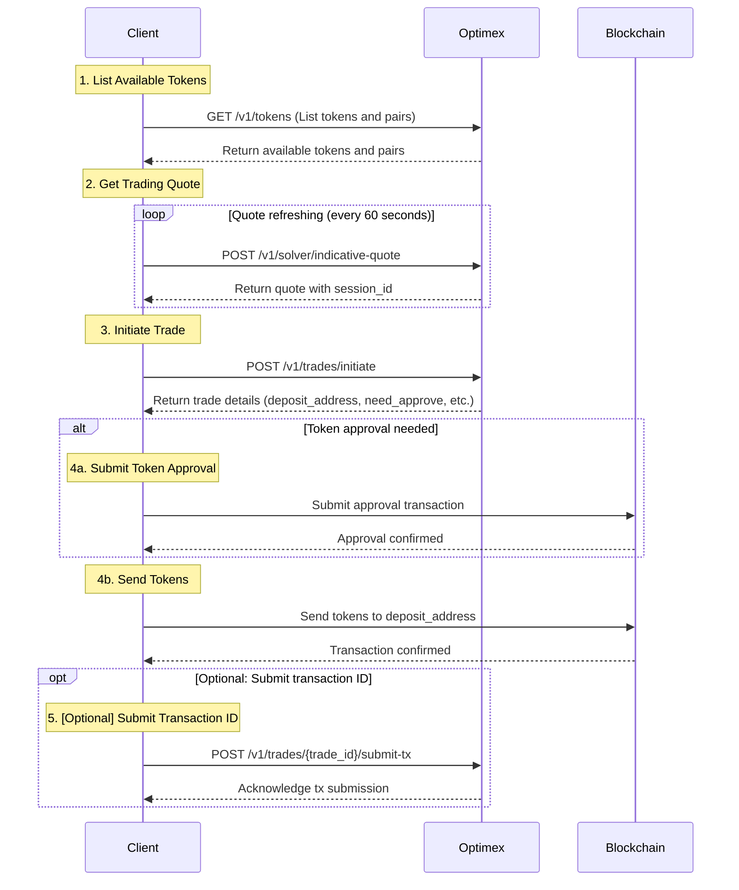

# Optimex API Integration Guide

## Part 1: Getting Started & Trading Flow

### Authentication
All API requests require an API key in the header.
```http
GET /v1/tokens
x-api-key: your_api_key
```

### Base URLs

### Required Trading Flow

The following sequence diagram illustrates the complete trading flow:



#### Step 1: Get Available Tokens
```http
GET /v1/tokens
```
Returns all supported networks, tokens, and trading pairs.

#### Step 2: Get Trading Quote
```http
POST /v1/solver/indicative-quote
```
- Refresh every 60 seconds while user is deciding
- Provides session_id needed for trade initiation

#### Step 3: Initiate Trade
```http
POST /v1/trades/initiate
```
- Uses session_id from latest quote
- Returns trade details and deposit information

#### Step 4: Token Operations
##### 4a. Token Approval (if needed)
- Check need_approve from trade initiation response
- If true, submit approval transaction with provided approve_address and approve_payload

##### 4b. Send Tokens
- Submit deposit transaction using the deposit_address and amount
- For native tokens: Include value in transaction
- For ERC20 tokens: Set value to 0, tokens transferred through contract call

#### Step 5: Submit Transaction ID (Optional)
```http
POST /v1/trades/{trade_id}/submit-tx
```
- Optional but recommended
- Helps with faster processing and better tracking

## Part 2: API Reference

### Token Management

#### List All Tokens and Pairs
```http
GET /v1/tokens
```

**Response** `200` (Example)
```json
{
  "data": {
    "supported_networks": [
      {
        "network_id": string,    // e.g., "ethereum", "bitcoin"
        "name": string,          // e.g., "Ethereum", "Bitcoin"
        "symbol": string,        // e.g., "ETH", "BTC"
        "type": string,          // e.g., "EVM", "UTXO"
        "logo_uri": string       // Network logo URL
      }
    ],
    "tokens": [
      {
        "network_id": string,        // e.g., "ethereum", "solana"
        "token_id": string,          // e.g., "usdt" (same across networks)
        "network_name": string,      // e.g., "Ethereum", "Solana"
        "network_symbol": string,    // e.g., "ETH", "SOL"
        "network_type": string,      // e.g., "EVM", "SOL"
        "token_name": string,        // e.g., "Tether USD"
        "token_symbol": string,      // e.g., "USDT"
        "token_address": string,     // Contract/mint address
        "token_decimals": number,    // e.g., 6 for USDT
        "token_logo_uri": string,    // Token logo URL
        "network_logo_uri": string   // Network logo URL
      }
    ],
    "pairs": [
      {
        "from_token_id": string,     // e.g., "usdt"
        "to_token_id": string,       // e.g., "btc"
        "is_active": boolean         // Whether pair is available for trading
      }
    ]
  }
}
```

### Trading Operations

#### Get Indicative Quote
```http
POST /v1/solver/indicative-quote
```

**Request Body**
```json
{
  "from_token_id": string,          // Token to send (e.g., "tBTC")
  "to_token_id": string,            // Token to receive (e.g., "ETH")
  "from_token_amount": string,      // Amount to send in smallest unit
  "affiliate_fee_bps": string       // Affiliate fee in basis points (optional)
}
```

**Response** `200` (Example)
```json
{
  "data": {
    "session_id": string,            // Required for initiating trade
    "best_quote": string,            // Estimated amount out before fees
    "best_quote_after_fees": string, // Estimated amount out after fees
    "protocol_fee": number,          // Fee percentage
    "pmm_finalists": [
      {
        "pmm_id": string,            // Market maker ID
        "pmm_receiving_address": string // Market maker address
      }
    ]
  }
}
```

#### Initiate Trade
```http
POST /v1/trades/initiate
```

**Request Body**
```json
{
  "session_id": string,          // From quote response
  "from_user_address": string,   // compressPublicKey for BTC and SOLANA, address for EVM
  "amount_in": string,           // Amount in smallest unit, bigint string, ex: 0.01 ETH -> "10000000000000000"
  "min_amount_out": string,      // Minimum acceptable output, bigint string
  "to_user_address": string,     // Receiving address
  "user_refund_address": string, // Refund address if trade fails
  "user_refund_pubkey": string,  // Refund pubkey if trade fails, in btc is pubkey and in evm is address
  "creator_public_key": string,  // Compressed public key, in btc is pubkey and in evm is address
  "trade_timeout": number,       // Optional, defaults to 2 hours
  "script_timeout": number,      // Optional, defaults to 24 hours
  "from_wallet_address": string, // Creator address
  "affiliate_info": [
    {
      "provider": string,      // Name of the affiliate provider
      "rate": string,          // Fee rate in basis points (e.g., "25" for 0.25%)
      "receiver": string,      // Provider address
      "network": string        // Optional: Network where affiliate fees will be paid
    }
  ]
}
```

**Response** `200` (Example)
```json
{
  "data": {
    "trade_id": string,          // Unique trade identifier
    "deposit_address": string,   // Address to send tokens to
    "payload": string,           // Only exists if trade from EVM
  }
}
```

#### Get Trade Status
```http
GET /v1/trades/{trade_id}
```

**Response** `200` (Example)
```json
{
  "data": {
    "trade_id": string,                    // Unique trade identifier
    "session_id": string,                  // Session ID from quote
    "solver_address": string,              // Solver contract address
    "from_token": {
      "token_id": string,                  // Token identifier (e.g., "ETH")
      "chain": string,                     // Chain name (e.g., "ethereum_sepolia")
      "address": string,                   // Token contract address or "native"
      "fee_in": boolean,                   // Whether token can be used for fees
      "fee_out": boolean                   // Whether fees can be paid in this token
    },
    "to_token": {
      "token_id": string,                  // Token identifier (e.g., "tBTC")
      "chain": string,                     // Chain name (e.g., "bitcoin_testnet")
      "address": string,                   // Token contract address or "native"
      "fee_in": boolean,                   // Whether token can be used for fees
      "fee_out": boolean                   // Whether fees can be paid in this token
    },
    "amount_before_fees": string,          // Original amount before fees
    "amount_after_fees": string,           // Amount after deducting fees
    "from_user_address": string,           // Sender's address
    "user_receiving_address": string,      // Recipient's address
    "script_timeout": number,              // Script expiration timestamp
    "protocol_fee_in_bps": string,         // Protocol fee in basis points
    "affiliate_fee_in_bps": string,        // Affiliate fee in basis points
    "total_fee": string,                   // Total fee amount
    "protocol_fee": string,                // Protocol fee amount
    "affiliate_fee": string,               // Affiliate fee amount
    "mpc_asset_chain_pubkey": string,      // MPC public key for asset chain
    "best_indicative_quote": string,       // Best quote before confirmation
    "display_indicative_quote": string,    // Displayed quote amount
    "pmm_finalists": [
      {
        "pmm_id": string,                  // Market maker identifier
        "pmm_receiving_address": string    // Market maker's receiving address
      }
    ],
    "settlement_quote": string,            // Final settlement amount
    "receiving_amount": string,            // Amount to be received
    "selected_pmm": string,                // Selected market maker ID
    "selected_pmm_receiving_address": string, // Selected market maker's address
    "selected_pmm_operator": string,       // Market maker operator address
    "selected_pmm_sig_deadline": number,   // Signature deadline timestamp
    "commitment_retries": number,          // Number of commitment retries
    "commited_signature": string,          // Commitment signature
    "trade_timeout": number,               // Trade expiration timestamp
    "user_deposit_tx": string,             // User's deposit transaction hash
    "deposit_vault": string,               // Deposit vault address
    "payment_bundle": {
      "trade_ids": [string],              // Array of related trade IDs
      "settlement_tx": string,             // Settlement transaction data
      "signature": string,                 // Payment bundle signature
      "start_index": number,               // Starting index
      "pmm_id": string,                    // Market maker ID
      "signed_at": number                  // Timestamp of signature
    },
    "user_signature": string,              // User's signature
    "trade_submission_tx": string,         // Trade submission transaction hash
    "trade_select_pmm_tx": string,        // PMM selection transaction hash
    "trade_make_payment_tx": string,       // Payment transaction hash
    "state": string,                       // Current trade state
    "last_update_msg": string,             // Last status update message
    "version": number                      // API version
  }
}
```

*List of current states in the solver*
Note: These states are internal to the solver design, and are different from trade stages on smart contracts

```go
	TradeStateInit                            = "Init"                            // Initial state after session creation
	TradeStateIndicated                       = "Indicated"                       // After indicative quotes are fetched
	TradeStateUserConfirmed                   = "UserConfirmed"                   // After users submit or update trade info
	TradeStateReadyToSubmitToL2               = "ReadyToSubmitToL2"               // After the trade info submitted by users is validated and deposit tx is mined
	TradeStateL2SubmissionStarted             = "L2SubmissionStarted"             // When the process to submit data to L2 started
	TradeStateInfoSubmittedToL2               = "TradeInfoSubmittedToL2"          // After trade info is submitted to the L2 protocol contract
	TradeStateDepositConfirmed                = "DepositConfirmed"                // Deposit is confirmed by L2 protocol contract
	TradeStateRequestForCommitmentStarted     = "RequestForCommitmentStarted"     // When the process of requesting for commitments from pmms started
	TradeStateCommitted                       = "Committed"                       // When a PMM commits a quote for the trade
	TradeStateWaitToRetryCommit               = "WaitToRetryCommit"               // When a trade failed to get a commitment from pmms, after some time the trade will transit to WaitToRetryCommit state to get ready to next commit attempt
	TradeStateStartedCommitmentSubmissionToL2 = "StartedCommitmentSubmissionToL2" // When the operator started its process to submit commitment data to L2
	TradeStateReadyForPayment                 = "ReadyForPayment"                 // When commitment for the trade is submitted to L2, in this state, waiting PMM to make payment
	TradeStateFailed                          = "Failed"                          // Trade is failed during the protocol process
	TradeStateUserCancelled                   = "UserCancelled"                   // When the trade is cancelled by the user
	TradeStatePaymentBundleSubmitted          = "PaymentBundleSubmitted"          // When the trade payment bundle information is submitted to L2
	TradeStatePaymentConfirmed                = "PaymentConfirmed"                // When the trade payment is confirmed by MPC that PMM has made payment
	TradeStateDone                            = "Done"                            // Everything is done from solver side
	TradeStateFailure                         = "Failure"                         // Trade is marked as Failure by a MPC node
	TradeStateToBeAborted                     = "ToBeAborted"                     // An intermediary state indicating the trade is marked to be aborted to avoid race condition
	TradeStateAborted                         = "Aborted"                         // Trade aborted due to failure or trade timeout

```
#### Submit Transaction (Optional)
```http
POST /v1/trades/{trade_id}/submit-tx
```

**Request Body**
```json
{
  "tx_id": string  // Transaction ID on asset chain
}
```

**Response** `200` (Example)
```json
{
  "data": {
    "msg": string  // Confirmation message
  }
}
```

#### Get Trade Estimation
```http
GET /v1/trades/estimate
```

**Query Parameters**
```
from_token: string    // Source token identifier (e.g., "ETH")
to_token: string      // Destination token identifier (e.g., "tBTC")
```

**Response** `200` (Example)
```json
{
  "data": {
    "estimated_time": number,     // Estimated completion time in seconds
    "updated_at": string         // Last update timestamp in ISO format
  }
}
```

### Code Example

```typescript
// Get quote every 60 seconds while user is deciding
const getQuote = async () => {
  const quote = await api.post('/v1/solver/indicative-quote', {
    from_token_id: "tBTC",
    to_token_id: "ETH",
    from_token_amount: "10000000000000000", // 0.01 ETH in wei
    affiliate_fee_bps: "25" // Optional: 0.25% affiliate fee
  });
  return quote.data;
};

// Initialize trade once user confirms
const initiateTrade = async (quoteData) => {
  const now = Math.floor(Date.now() / 1000); // Current timestamp in seconds
  const trade = await api.post('/v1/trades/initiate', {
    session_id: quoteData.session_id,
    from_user_address: "0x19ce4de99ce88bc4a759e8dbdec42724eecb666f", // EVM address
    to_user_address: "tb1pr00d3pkyhp7aghwk0y8g7mjsau9hkll3m8djdwqw4eukmw79ym2qp97t3v", // BTC address
    user_refund_address: "0x19ce4de99ce88bc4a759e8dbdec42724eecb666f", // EVM address for refunds
    user_refund_pubkey: "0x19ce4de99ce88bc4a759e8dbdec42724eecb666f", // Same as refund address for EVM
    creator_public_key: "0x19ce4de99ce88bc4a759e8dbdec42724eecb666f", // Compressed public key
    amount_in: "10000000000000000", // 0.01 ETH in wei
    min_amount_out: quoteData.best_quote,
    trade_timeout: now + 7200, // Current timestamp + 2 hours
    script_timeout: now + 86400, // Current timestamp + 24 hours
    from_wallet_address: "0x19ce4de99ce88bc4a759e8dbdec42724eecb666f", // Creator address
    affiliate_info: [
      {
        provider: "Optimex Protocol",
        rate: "25", // 0.25% in basis points
        receiver: "0x4534c971921956e9f705fa3e9c73d7dfd7669166",
        network: "ethereum"
      }
    ]
  });

  // Send the tokens
  const depositTx = await wallet.sendTransaction({
    to: trade.data.deposit_address,
    value: trade.data.amount_in, // For native tokens
    data: trade.data.payload // For EVM tokens
  });

  // Optional: Notify about transaction
  await api.post(`/v1/trades/${trade.data.trade_id}/submit-tx`, {
    tx_id: depositTx.hash
  });

  return depositTx;
};
```

## Part 3: Affiliate Provider APIs

The following APIs enable affiliate providers to manage their commissions and claims.

### Provider Account Management

#### Get Provider Account Balances
```http
GET /v1/provider/account/:providerAddress
```

Returns commission balances with USD values for all tokens and networks for the specified provider.

**Parameters**
```
providerAddress: string   // Provider address to get balances for
```

**Response** `200` (Example)
```json
{
  "data": {
    "provider_address": string,              // Provider's address
    "total_commission_usd": number,          // Total commission value in USD
    "available_usd_value": number,           // Available balance in USD
    "commissions_by_token": [
      {
        "token": {
          "token_id": string,                // Token identifier
          "token_name": string,              // Token name
          "token_symbol": string,            // Token symbol
          "token_logo_uri": string,          // Token logo URL
          "token_decimals": number           // Token decimal places
        },
        "total_commission": string,          // Total commission in token amount
        "balance": string,                   // Available balance in token amount
        "total_commission_usd": number,      // Total commission in USD
        "available_usd": number,             // Available balance in USD
        "total_txs": number                  // Total number of commission transactions
      }
    ]
  }
}
```

#### Get Provider Transactions by Token
```http
GET /v1/provider/account/:providerAddress/:tokenId
```

Returns list of transactions for the specified provider address and token ID, sorted by created_at desc with pagination.

**Parameters**
```
providerAddress: string   // Provider address
tokenId: string          // Token ID (e.g., "usdt", "btc")
page: number             // Optional: Page number (default: 1)
limit: number            // Optional: Number of items per page (default: 10)
txType: string           // Optional: Transaction type filter (default: "COMMISSION")
```

**Query Parameters**
```
txType: "COMMISSION" | "REFUND" | "WITHDRAWAL"   // Filter by transaction type
```

**Response** `200` (Example)
```json
{
  "data": [
    {
      "id": number,                        // Transaction ID
      "provider_address": string,          // Provider's address
      "referee_address": string,           // Referee's address (nullable)
      "token_id": string,                  // Token identifier
      "amount": string,                    // Transaction amount
      "transaction_type": string,          // Transaction type: "COMMISSION", "REFUND", "WITHDRAWAL"
      "commission_rate": number,           // Commission rate in basis points (nullable)
      "trade_id": string,                  // Related trade ID (nullable)
      "claim_id": string,                  // Related claim ID (nullable)
      "created_at": string,                // Creation timestamp (ISO format)
      "updated_at": string                 // Last update timestamp (ISO format)
    }
  ],
  "paging": {
    "total": number,                      // Total number of transactions
    "page": number,                       // Current page
    "limit": number,                      // Items per page
    "pages": number                       // Total number of pages
  }
}
```

### Provider Claims

#### Create Withdrawal Claim
```http
POST /v1/provider/claim
```

Creates a withdrawal claim for the provider to withdraw their commission.

**Request Body**
```json
{
  "provider_address": string,     // Provider's address
  "public_key": string,           // Public key (same as provider_address for EVM/SOLANA)
  "timestamp": number,            // Current timestamp (must be within 5 minutes)
  "receiver_address": string,     // Address to receive funds
  "chain_type": string,           // Chain type: "BTC", "EVM", "SOLANA"
  "signature": string             // Signature of the request using provider wallet to sign message: "Claim reward for wallet {provider_address} at {timestamp}"
}
```

**Response** `200` (Example)
```json
{
  "data": {
    "claim_id": string,           // Unique claim identifier
    "status": string,             // Claim status
    "total_usd_amount": string,   // Total USD amount claimed
    "chain_type": string,         // Chain type for this claim
    "created_at": string          // Creation timestamp (ISO format)
  }
}
```

#### Get Provider Claims
```http
GET /v1/provider/claims/:providerAddress
```

Returns claims for the specified provider with optional status filtering and pagination.

**Parameters**
```
providerAddress: string   // Provider address to get claims for
status: string            // Optional: Filter claims by status
page: number              // Optional: Page number (default: 1)
limit: number             // Optional: Number of items per page (default: 10)
```

**Response** `200` (Example)
```json
{
  "data":  [
    {
      "id": number,                      // Internal ID
      "claim_id": string,                // Unique claim identifier
      "provider_address": string,        // Provider's address
      "receiver_address": string,        // Address to receive funds
      "timestamp": string,               // Request timestamp (bigint as string)
      "signature": string,               // Request signature
      "chain_type": string,              // Chain type: "BTC", "EVM", "SOLANA"
      "status": string,                  // Claim status: "PENDING", "APPROVED", "REJECTED", "COMPLETED", "FAILED"
      "total_usd_amount": string,        // Total USD value
      "claim_txs": [                     // Array of token transfer transactions
        {
          "id": number,                  // Transaction ID
          "token_id": string,            // Token identifier
          "token_symbol": string,        // Token symbol
          "amount": string,              // Token amount
          "usd_value": string,           // USD value
          "tx_hash": string,             // Transaction hash (nullable)
          "status": string,              // Transaction status
          "created_at": string,          // Creation timestamp
          "updated_at": string           // Last update timestamp
        }
      ],
      "admin_notes": string,             // Admin notes (nullable)
      "processed_by": string,            // Address of processor (nullable)
      "processed_at": string,            // Processing timestamp (nullable)
      "created_at": string,              // Creation timestamp
      "updated_at": string               // Last update timestamp
    }
  ],
  "paging": {
    "total": number,                    // Total number of claims
    "page": number,                     // Current page
    "limit": number,                    // Items per page
    "pages": number                     // Total number of pages
  }
}
```

## Part 4: Trade Search APIs

### Search Trade by Transaction

#### Search Trade by Deposit or Settlement Transaction
```http
GET /v1/trades/search
```

Search for a trade using either deposit transaction ID or settlement transaction ID.

**Query Parameters**
```
depositTxId: string      // Optional: Deposit transaction ID to search for
settlementTxId: string   // Optional: Settlement transaction ID to search for
```

**Note**: Either `depositTxId` or `settlementTxId` must be provided, but not both.

**Response** `200` (Example)
```json
{
  "data": {
    "id": number,                          // Internal trade ID
    "trade_id": string,                    // Unique trade identifier
    "status": string,                      // Trade status (e.g., "SETTLEMENT_CONFIRMED")
    "trade_timeout": number,               // Trade timeout timestamp
    "script_timeout": number,              // Script timeout timestamp
    "timestamp": number,                   // Trade creation timestamp
    "from_user_address": string,           // Sender's address
    "to_user_address": string,             // Recipient's address
    "org_id": string,                      // Organization ID (nullable)
    "processed_auto": boolean,             // Whether processed automatically
    "processed_at": string,                // Processing timestamp (nullable)
    "deposit_tx_id": string,               // Deposit transaction ID
    "settlement_tx_id": string,            // Settlement transaction ID
    "swap_type": string,                   // Swap type (e.g., "OPTIMISTIC")
    "amount_in": string,                   // Input amount (nullable)
    "from_token": {
      "id": number,                        // Token database ID
      "active": boolean,                   // Whether token is active
      "token_id": string,                  // Token identifier (e.g., "tBTC")
      "created_at": string,                // Creation timestamp
      "network_id": string,                // Network identifier
      "token_name": string,                // Token name
      "updated_at": string,                // Last update timestamp
      "network_name": string,              // Network name
      "network_type": string,              // Network type (e.g., "BTC", "EVM")
      "token_symbol": string,              // Token symbol
      "token_address": string,             // Token contract address or "native"
      "token_logo_uri": string,            // Token logo URL
      "network_symbol": string,            // Network symbol
      "token_decimals": number,            // Token decimal places
      "network_logo_uri": string           // Network logo URL
    },
    "to_token": {
      "id": number,                        // Token database ID
      "active": boolean,                   // Whether token is active
      "token_id": string,                  // Token identifier (e.g., "ETH")
      "created_at": string,                // Creation timestamp
      "network_id": string,                // Network identifier
      "token_name": string,                // Token name
      "updated_at": string,                // Last update timestamp
      "network_name": string,              // Network name
      "network_type": string,              // Network type (e.g., "BTC", "EVM")
      "token_symbol": string,              // Token symbol
      "token_address": string,             // Token contract address or "native"
      "token_logo_uri": string,            // Token logo URL
      "network_symbol": string,            // Network symbol
      "token_decimals": number,            // Token decimal places
      "network_logo_uri": string           // Network logo URL
    },
    "created_at": string,                  // Creation timestamp (ISO format)
    "updated_at": string,                  // Last update timestamp (ISO format)
    "events": [                            // Array of trade events
      {
        "trade_id": string,                // Trade identifier
        "action": string,                  // Event action (e.g., "ConfirmSettlement", "MakePayment")
        "tx_id": string,                   // Transaction ID
        "block_number": number,            // Block number
        "timestamp": number,               // Event timestamp
        "input_data": object,              // Event-specific data
        "created_at": string,              // Creation timestamp (ISO format)
        "updated_at": string               // Last update timestamp (ISO format)
      }
    ]
  },
  "traceId": string                        // Request trace ID for debugging
}
```

**Event Actions Include:**
- `INIT` - Trade initialization
- `PRE_SUBMIT` - Pre-submission preparation
- `SubmitTradeInfo` - Trade information submitted
- `ConfirmDeposit` - Deposit confirmed
- `SelectPMM` - Market maker selected
- `MakePayment` - Payment made
- `ConfirmPayment` - Payment confirmed
- `ConfirmSettlement` - Settlement confirmed

**Response** `404` - Trade not found
```json
{
  "error": {
    "message": "Trade not found",
    "code": "TRADE_NOT_FOUND"
  }
}
```

#### Creating the Signature for Withdrawal Claims

To create a valid signature for withdrawal claims, follow these steps:

1. **Construct the message string**:
   ```javascript
   const message = `Claim reward for wallet ${providerAddress} at ${timestamp}`;
   ```
   Where:
   - `providerAddress` is the provider's wallet address
   - `timestamp` is the current Unix timestamp in milliseconds

2. **Sign the message with the provider's private key**:

   Using ethers.js v6:
   ```javascript
   // Import ethers
   import { ethers } from "ethers";

   // Connect to the provider (e.g., MetaMask)
   const provider = new ethers.BrowserProvider(window.ethereum);
   const signer = await provider.getSigner();

   // Sign the message
   const signature = await signer.signMessage(message);
   ```

3. **Include the signature in your request**:
   ```javascript
   const request = {
     provider_address: providerAddress,
     public_key: providerAddress,        // For EVM chains, this is the same as providerAddress
     timestamp: timestamp,
     receiver_address: receiverAddress,
     signature: signature
   };
   ```

4. **Verify the signature (server-side)**:
   The server will verify that:
   - The message format is correct
   - The timestamp is within 5 minutes of the current time
   - The signature is valid for the given provider address
   - The public_key matches the provider_address

**Note**: The signature will be considered invalid if:
- The timestamp is more than 5 minutes old
- The message format is incorrect
- The signature doesn't match the expected signer
