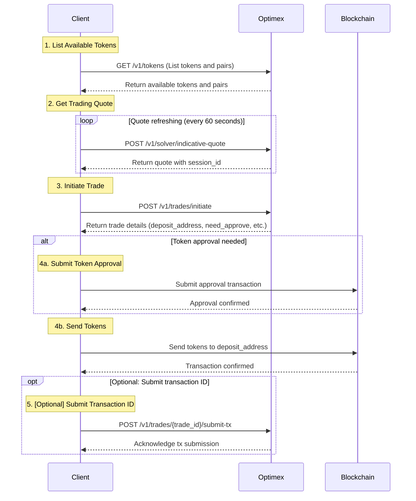

# Optimex API Integration Guide

## Part 1: Getting Started & Trading Flow

### Authentication
All API requests require an API key in the header.
```http
GET /v1/tokens
x-api-key: your_api_key
```

### Base URLs

### Required Trading Flow

The following sequence diagram illustrates the complete trading flow:



#### Step 1: Get Available Tokens
```http
GET /v1/tokens
```
Returns all supported networks, tokens, and trading pairs.

#### Step 2: Get Trading Quote
```http
POST /v1/solver/indicative-quote
```
- Refresh every 60 seconds while user is deciding
- Provides session_id needed for trade initiation

#### Step 3: Initiate Trade
```http
POST /v1/trades/initiate
```
- Uses session_id from latest quote
- Returns trade details and deposit information

#### Step 4: Token Operations
##### 4a. Token Approval (if needed)
- Check need_approve from trade initiation response
- If true, submit approval transaction with provided approve_address and approve_payload

##### 4b. Send Tokens
- Submit deposit transaction using the deposit_address and amount
- For native tokens: Include value in transaction
- For ERC20 tokens: Set value to 0, tokens transferred through contract call

#### Step 5: Submit Transaction ID (Optional)
```http
POST /v1/trades/{trade_id}/submit-tx
```
- Optional but recommended
- Helps with faster processing and better tracking

## Part 2: API Reference

### Token Management

#### List All Tokens and Pairs
```http
GET /v1/tokens
```

**Response** `200` (Example)
```json
{
  "data": {
    "supported_networks": [
      {
        "network_id": string,    // e.g., "ethereum", "bitcoin"
        "name": string,          // e.g., "Ethereum", "Bitcoin"
        "symbol": string,        // e.g., "ETH", "BTC"
        "type": string,          // e.g., "EVM", "UTXO"
        "logo_uri": string       // Network logo URL
      }
    ],
    "tokens": [
      {
        "network_id": string,        // e.g., "ethereum", "solana"
        "token_id": string,          // e.g., "usdt" (same across networks)
        "network_name": string,      // e.g., "Ethereum", "Solana"
        "network_symbol": string,    // e.g., "ETH", "SOL"
        "network_type": string,      // e.g., "EVM", "SOL"
        "token_name": string,        // e.g., "Tether USD"
        "token_symbol": string,      // e.g., "USDT"
        "token_address": string,     // Contract/mint address
        "token_decimals": number,    // e.g., 6 for USDT
        "token_logo_uri": string,    // Token logo URL
        "network_logo_uri": string   // Network logo URL
      }
    ],
    "pairs": [
      {
        "from_token_id": string,     // e.g., "usdt"
        "to_token_id": string,       // e.g., "btc"
        "is_active": boolean         // Whether pair is available for trading
      }
    ]
  }
}
```

### Trading Operations

#### Get Indicative Quote
```http
POST /v1/solver/indicative-quote
```

**Request Body**
```json
{
  "from_token_id": string,          // Token to send (e.g., "tBTC")
  "to_token_id": string,            // Token to receive (e.g., "ETH")
  "from_token_amount": string,      // Amount to send in smallest unit
  "affiliate_fee_bps": string       // Affiliate fee in basis points (optional)
}
```

**Response** `200` (Example)
```json
{
  "data": {
    "session_id": string,            // Required for initiating trade
    "best_quote": string,            // Estimated amount out before fees
    "best_quote_after_fees": string, // Estimated amount out after fees
    "protocol_fee": number,          // Fee percentage
    "pmm_finalists": [
      {
        "pmm_id": string,            // Market maker ID
        "pmm_receiving_address": string // Market maker address
      }
    ]
  }
}
```

#### Initiate Trade
```http
POST /v1/trades/initiate
```

**Request Body**
```json
{
  "session_id": string,          // From quote response
  "from_user_address": string,   // compressPublicKey for BTC and SOLANA, address for EVM
  "amount_in": string,           // Amount in smallest unit, bitint string, ex: 0.01 ETH -> "10000000000000000"
  "min_amount_out": string,      // Minimum acceptable output, bigint string
  "to_user_address": string,     // Receiving address
  "user_refund_address": string, // Refund address if trade fails
  "user_refund_pubkey": string, // Refund pubkey if trade fails, in btc is pubkey and in evm is address
  "creator_public_key": string,  // Compressed public key
  "trade_timeout": number,       // Optional, defaults to 2 hours
  "script_timeout": number,      // Optional, defaults to 24 hours
  "from_wallet_address": string,  // Creator address
  "affiliate_info": {
    "data": string, // 0x00000000000000000000000000000000000000000000000000000000000000200000000000000000000000000000000000000000000000000000000000000001000000000000000000000000000000000000000000000000000000000000002000000000000000000000000000000000000000000000000000000000000000800000000000000000000000000000000000000000000000000000000000000bb800000000000000000000000000000000000000000000000000000000000000c00000000000000000000000000000000000000000000000000000000000000120000000000000000000000000000000000000000000000000000000000000000e42697466692070726f746f636f6c000000000000000000000000000000000000000000000000000000000000000000000000000000000000000000000000002c39775438586250736f4b6348326850414375383246474546395833466b7448663371624b417a35384d54564800000000000000000000000000000000000000000000000000000000000000000000000000000000000000000000000000000006736f6c616e610000000000000000000000000000000000000000000000000000
    "schema": string, // "{\"format\":\"json\",\"encoding\":\"abi.encode\",\"schema\":{\"affiliates\":[{\"provider\":\"string\",\"rate\":\"uint256\",\"receiver\":\"string\",\"network\":\"string\"}]}}"
    "aggregated_value": string // "3000"
  }
}
```

**Response** `200` (Example)
```json
{
  "data": {
    "trade_id": string,          // Unique trade identifier
    "deposit_address": string,   // Address to send tokens to
    "payload": string,           // Only exists if trade from EVM
  }
}
```

#### Get Trade Status
```http
GET /v1/trades/{trade_id}
```

**Response** `200` (Example)
```json
{
  "data": {
    "id": number,
    "trade_id": string,
    "session_id": string,
    "status": string,            // Current trade status
    "timestamp": number,
    "from_user_address": string,
    "to_user_address": string,
    "events": [
      {
        "trade_id": string,
        "action": string,        // Action performed
        "tx_id": string,         // Transaction ID
        "block_number": number,
        "timestamp": number,
        "input_data": object     // Additional data about the event
      }
    ]
  }
}
```

#### Submit Transaction (Optional)
```http
POST /v1/trades/{trade_id}/submit-tx
```

**Request Body**
```json
{
  "tx_id": string  // Transaction ID on asset chain
}
```

**Response** `200` (Example)
```json
{
  "data": {
    "msg": string  // Confirmation message
  }
}
```

### Code Example

```typescript
// Get quote every 60 seconds while user is deciding
const getQuote = async () => {
  const quote = await api.post('/v1/solver/indicative-quote', {
    from_token_id: "tBTC",
    to_token_id: "ETH",
    from_token_amount: "100000"
  });
  return quote.data;
};

// Initialize trade once user confirms
const initiateTrade = async (quoteData) => {
  const trade = await api.post('/v1/trades/initiate', {
    session_id: quoteData.session_id,
    from_user_address: "0x...",
    to_user_address: "0x...",
    user_refund_address: "0x...",
    creator_public_key: "0x...",
    amount_in: "100000",
    min_amount_out: quoteData.best_quote
  });

  // Send the tokens
  const depositTx = await wallet.sendTransaction(
    trade.data.deposit_address,
    trade.data.deposit_amount
  );

  // Optional: Notify about transaction
  await api.post(`/v1/trades/${trade.data.trade_id}/submit-tx`, {
    tx_id: depositTx.hash
  });

  return depositTx;
};
```
